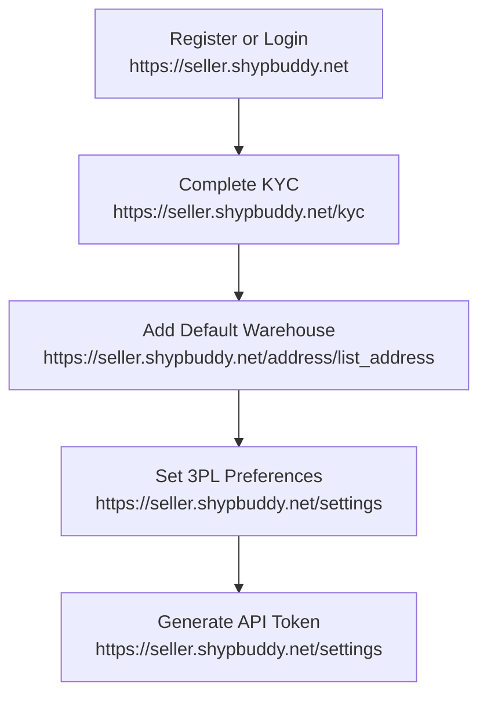

# ShypBuddy API Integration

This repository provides comprehensive documentation for integrating with the ShypBuddy API, enabling order creation, PDF generation, thermal label generation, order cancellation, rate calculation, and shipment tracking.

## Table of Contents
- [Overview](#overview)
- [Setup Workflow](#setup-workflow)
- [Authentication](#authentication)
- [API Endpoints](#api-endpoints)
  - [Create Custom Order](#create-custom-order)
  - [Create Order](#create-order)
  - [Generate PDF](#generate-pdf)
  - [Generate PDF Thermal Label](#generate-pdf-thermal-label)
  - [Cancel Order](#cancel-order)
  - [Rate Calculator](#rate-calculator)
  - [Shipment Tracking](#shipment-tracking)
- [Swagger Documentation](#swagger-documentation)
- [Support](#support)

## Overview

The ShypBuddy API allows sellers to automate order processing, generate shipping documents, calculate shipping rates, track shipments, and manage cancellations. All endpoints require authentication via a Bearer token.

## Setup Workflow

To use the ShypBuddy API, follow these steps:



1. **Register or Login**: Sign up or log in at [https://seller.shypbuddy.net](https://seller.shypbuddy.net).
2. **Complete KYC**: Verify your identity at [https://seller.shypbuddy.net/kyc](https://seller.shypbuddy.net/kyc).
3. **Add Default Warehouse**: Configure your warehouse at [https://seller.shypbuddy.net/address/list_address](https://seller.shypbuddy.net/address/list_address).
4. **Set 3PL Preferences**: Update preferences at [https://seller.shypbuddy.net/settings](https://seller.shypbuddy.net/settings).
5. **Generate API Token**: Obtain your token from [https://seller.shypbuddy.net/settings](https://seller.shypbuddy.net/settings).

## Authentication

All API requests require the following headers:

- **Content-Type**: `application/json`
- **Authorization**: `Bearer <your_generated_token>`

Replace `<your_generated_token>` with the token from the settings page.

## API Endpoints

### Create Custom Order

Create an order with a specified delivery partner.

- **Method**: POST
- **URL**: `https://seller.shypbuddy.net/api/orderApi/customOrderApi`

#### Request Body
```json
{
  "orderData": {
    "deliveryType": "FORWARD",
    "isDangerousGoods": "n",
    "paymentMode": "prepaid",
    "length": 10,
    "breadth": 10,
    "height": 15,
    "packageCount": 2,
    "shippingMode": "air",
    "deadWeight": 0.5,
    "deliveryPartner": "bluedart surface"
  },
  "customerAddressList": {
    "fullName": "Rahul Kumar",
    "contactNumber": "9876543210",
    "email": "rahul.kumar@email.com",
    "alternateNumber": "8765432109",
    "buyerCompanyName": "Tech Solutions Pvt Ltd",
    "buyerGstin": "27AAPFU0939F1ZV",
    "address": "B-404, Silver Heights, Sector 7",
    "landmark": "Near City Mall",
    "pincode": 110001,
    "createdAt": "2024-03-21T10:30:00Z",
    "city": "Mumbai",
    "state": "Maharashtra"
  },
  "packageList": [
    {
      "name": "Gaming Laptop",
      "qty": 1,
      "price": 82,
      "category": "Electronics",
      "sku": "LAP-GM-001",
      "hsnCode": "847130"
    },
    {
      "name": "Wireless Mouse",
      "qty": 2,
      "price": 12,
      "category": "Electronics",
      "sku": "ACC-MS-002",
      "hsnCode": "847160"
    }
  ],
  "pickUpAddress": {
    "address": "2285 N Hobart Blvd, Los Angeles",
    "landmark": "Hollywood Hills",
    "pincode": 400064,
    "city": "LA",
    "state": "Cali",
    "country": "USA"
  }
}
```

#### Example Request
```bash
curl -X POST https://seller.shypbuddy.net/api/orderApi/customOrderApi \
-H "Content-Type: application/json" \
-H "Authorization: Bearer YOUR_ACCESS_TOKEN" \
-d '{...}' # Replace with the above JSON
```

### Create Order

Create an order without specifying a delivery partner.

- **Method**: POST
- **URL**: `https://seller.shypbuddy.net/api/orderApi/createOrder`

#### Request Body
```json
{
  "orderData": {
    "deliveryType": "FORWARD",
    "isDangerousGoods": "n",
    "paymentMode": "cod",
    "length": 10,
    "breadth": 10,
    "height": 15,
    "warehouseName": "spotlight 27",
    "packageCount": 2,
    "shippingMode": "surface",
    "deadWeight": 0.5
  },
  "customerAddressList": {
    "fullName": "Rahul Kumar",
    "contactNumber": "9876543210",
    "email": "rahul.kumar@email.com",
    "alternateNumber": "8765432109",
    "buyerCompanyName": "Tech Solutions Pvt Ltd",
    "buyerGstin": "27AAPFU0939F1ZV",
    "address": "B-404, Silver Heights, Sector 7",
    "landmark": "Near City Mall",
    "pincode": 400028,
    "createdAt": "2024-03-21T10:30:00Z",
    "city": "Mumbai",
    "state": "Maharashtra"
  },
  "packageList": [
    {
      "name": "Gaming Laptop",
      "qty": 1,
      "price": 82,
      "category": "Electronics",
      "sku": "LAP-GM-001",
      "hsnCode": "847130"
    },
    {
      "name": "Wireless Mouse",
      "qty": 2,
      "price": 12,
      "category": "Electronics",
      "sku": "ACC-MS-002",
      "hsnCode": "847160"
    }
  ]
}
```

#### Example Request
```bash
curl -X POST https://seller.shypbuddy.net/api/orderApi/createOrder \
-H "Content-Type: application/json" \
-H "Authorization: Bearer YOUR_ACCESS_TOKEN" \
-d '{...}' # Replace with the above JSON
```

### Generate PDF

Generate a PDF for specified AWBs.

- **Method**: POST
- **URL**: `https://seller.shypbuddy.net/api/generatePdf2/generatePdf`

#### Request Body
```json
{
  "awbs": ["10610372058", "10610372059"]
}
```

#### Example Request
```bash
curl -X POST https://seller.shypbuddy.net/api/generatePdf2/generatePdf \
-H "Content-Type: application/json" \
-H "Authorization: Bearer YOUR_ACCESS_TOKEN" \
-d '{"awbs": ["10610372058", "10610372059"]}'
```

#### Response
The response contains the generated PDF file. Handle it appropriately to store or display.

### Generate PDF Thermal Label

Generate a thermal label PDF for specified AWBs.

- **Method**: POST
- **URL**: `https://seller.shypbuddy.net/api/generatePdf2/generatePdfThermalLabel`

#### Request Body
```json
{
  "awbs": ["10610372058", "10610372059"]
}
```

#### Example Request
```bash
curl -X POST https://seller.shypbuddy.net/api/generatePdf2/generatePdfThermalLabel \
-H "Content-Type: application/json" \
-H "Authorization: Bearer YOUR_ACCESS_TOKEN" \
-d '{"awbs": ["10610372058", "10610372059"]}'
```

#### Response
The response contains the generated thermal label PDF. Handle it appropriately to store or display.

### Cancel Order

Cancel orders by specifying AWBs.

- **Method**: POST
- **URL**: `https://seller.shypbuddy.net/api/orderApi/cancelOrderApi`

#### Request Body
```json
{
  "awbs": ["18517412101444"]
}
```

#### Example Request
```bash
curl -X POST https://seller.shypbuddy.net/api/orderApi/cancelOrderApi \
-H "Content-Type: application/json" \
-H "Authorization: Bearer YOUR_ACCESS_TOKEN" \
-d '{"awbs": ["18517412101444"]}'
```

#### Response
```json
{
  "status": "success",
  "message": "Orders canceled successfully."
}
```

### Rate Calculator

Calculate shipping rates based on delivery parameters.

- **Method**: POST
- **URL**: `https://api.shypbuddy.net/api/direct-api/rate-calculator`

#### Request Body
```json
{
  "deliveryData": {
    "pickupPin": "400601",
    "deliveryPin": "400064",
    "actualWeight": "0.5",
    "length": "5",
    "breadth": "6",
    "height": "6",
    "paymentType": "cod",
    "volumetricWeight": 0.036,
    "applicableWeight": 0.5,
    "shipmentValue": "10",
    "isDangerousGoods": false,
    "isReverse": false
  }
}
```

#### Example Request
```bash
curl -X POST https://api.shypbuddy.net/api/direct-api/rate-calculator \
-H "Content-Type: application/json" \
-H "Authorization: Bearer YOUR_ACCESS_TOKEN" \
-d '{...}' # Replace with the above JSON
```

### Shipment Tracking

Track shipments by AWB numbers.

- **Method**: GET
- **URL**: `https://api.shypbuddy.net/api/direct-api/shipment-tracking`

#### Query Parameters
- `awbNumbers`: Comma-separated AWB numbers (e.g., `143449428418,1430523027`)

#### Example Request
```bash
curl -X GET "https://api.shypbuddy.net/api/direct-api/shipment-tracking?awbNumbers=143449428418,1430523027" \
-H "Authorization: Bearer YOUR_ACCESS_TOKEN"
```

#### Response
```json
{
  "success": true,
  "data": [
    {
      "awbNumber": "143449428418",
      "status": "DELIVERED"
    },
    {
      "awbNumber": "1430523027",
      "status": "DELIVERED"
    }
  ],
  "message": "Tracking fetched successfully"
}
```

## Swagger Documentation

For an interactive view of the API, copy the `openapi.yaml` into [Swagger Editor](https://editor-next.swagger.io/).

## Support

For questions or assistance, contact the ShypBuddy support team at [support@shypbuddy.net](mailto:support@shypbuddy.net).

---

