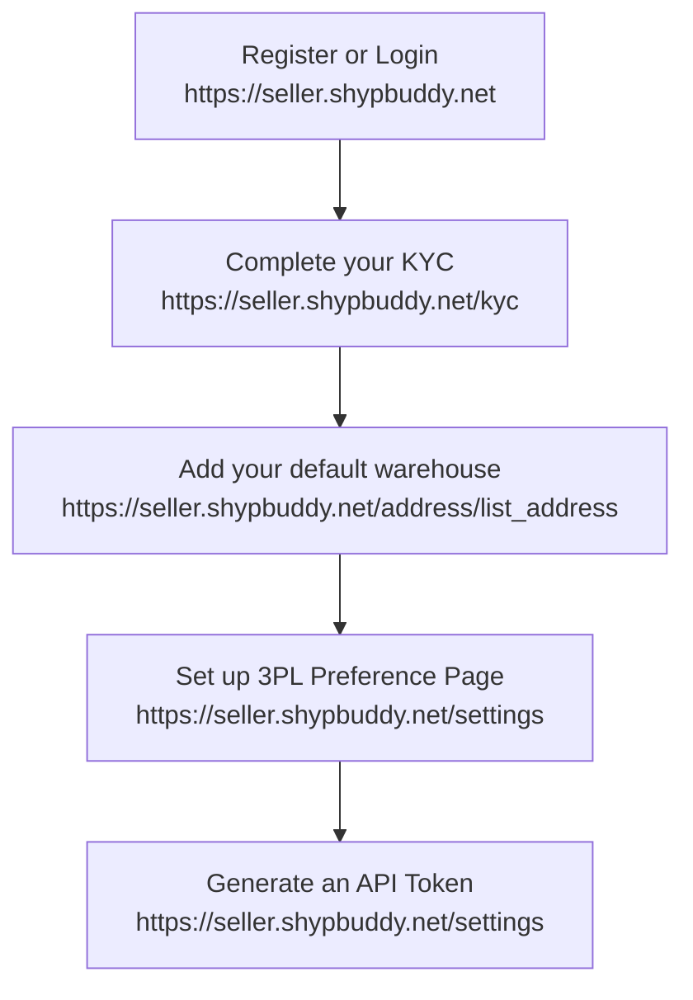

# API Creation Guide

This guide outlines the steps to create and use the API for order creation on the ShypBuddy platform.

## Workflow Graph

The following diagram explains the sequence of steps you need to follow:



## API Endpoint Details

Once you have completed the initial steps and generated a token, you can use the API endpoint to create orders.

### Endpoint

```
https://seller.shypbuddy.net/api/orderApi/createOrder
```

### Headers

- **Content-Type:** `application/json`
- **Authorization:** `Bearer <your_generated_token>`

> Replace `<your_generated_token>` with the token you generated from the settings page.

### Request Body

Below is an example request body:

```json
{
  "orderData": {
    "deliveryType": "FORWARD", // Options: "FORWARD" or "REVERSE"
    "isDangerousGoods": "n",     // "n" for no or "y" for yes
    "paymentMode": "cod",        // Options: "cod" or "prepaid"
    "length": 10,
    "breadth": 10,
    "height": 15,
    "warehouseName": "Warehouse", // Default warehouse name
    "packageCount": 2,
    "shippingMode": "surface",    // Options: "surface" or "air"
    "deadWeight": 0.5
    // "deliveryPartner": "shadowfax" // Optional: Uncomment if applicable
  },
  "customerAddressList": {
    "fullName": "Rahul Kumar",
    "contactNumber": "9876543210",
    "email": "rahul.kumar@email.com",
    "alternateNumber": "8765432109",
    "buyerCompanyName": "Tech Solutions Pvt Ltd",
    "buyerGstin": "27AAPFU0939F1ZV",
    "address": "B-404, Silver Heights, Sector 7",
    "landmark": "Near City Mall",
    "pincode": 400028,
    "createdAt": "2024-03-21T10:30:00Z",
    "city": "Mumbai",
    "state": "Maharashtra"
  },
  "packageList": [
    {
      "name": "Gaming Laptop",
      "qty": 1,
      "price": 82,
      "category": "Electronics",
      "sku": "LAP-GM-001",
      "hsnCode": "847130"
    },
    {
      "name": "Wireless Mouse",
      "qty": 2,
      "price": 12,
      "category": "Electronics",
      "sku": "ACC-MS-002",
      "hsnCode": "847160"
    }
  ]
}
```

## Usage Steps Summary

1. **Register or Login:**
   - Visit [https://seller.shypbuddy.net](https://seller.shypbuddy.net) to register or log in to your account.

2. **Complete your KYC:**
   - Complete your KYC at [https://seller.shypbuddy.net/kyc](https://seller.shypbuddy.net/kyc).

3. **Add your Default Warehouse:**
   - Set up your default warehouse at [https://seller.shypbuddy.net/address/list_address](https://seller.shypbuddy.net/address/list_address).

4. **Configure 3PL Preferences:**
   - Go to the 3PL Preference Page at [https://seller.shypbuddy.net/settings](https://seller.shypbuddy.net/settings).

5. **Generate an API Token:**
   - Generate your API token from [https://seller.shypbuddy.net/settings](https://seller.shypbuddy.net/settings) and use it in your API requests.

Follow the guide and the examples to integrate with the API successfully.

This repository provides an example of how to integrate with the ShypBuddy API for generating PDFs. Below you will find the necessary details to make API requests, including authentication and request payload.

## API Endpoint

### Generate PDF
```
POST https://seller.shypbuddy.net/api/generatePdf2/generatePdf
```

## Headers

- `Content-Type`: `application/json`
- `Authorization`: `Bearer YOUR_ACCESS_TOKEN`

## Request Payload

The request payload should be a JSON object containing a list of AWB numbers. Here is an example:

```json
{
  "awbs": ["10610372058", "10610372059"]
}
```

## Example Request

Below is an example of how to make the API request using `curl`:

```bash
curl -X POST https://seller.shypbuddy.net/api/generatePdf2/generatePdf \
-H "Content-Type: application/json" \
-H "Authorization: Bearer YOUR_ACCESS_TOKEN" \
-d '{
  "awbs": ["10610372058", "10610372059"]
}'
```

## Authentication

Make sure to replace `YOUR_ACCESS_TOKEN` with your actual access token. You can obtain an access token by logging in to your ShypBuddy account and navigating to the API settings.

## Response

The response will contain the generated PDF file. Ensure to handle the response appropriately in your application to display or store the PDF.


## Contact

For any questions or support, please contact the ShypBuddy support team at [support@shypbuddy.net](mailto:support@shypbuddy.net).
```` ▋
